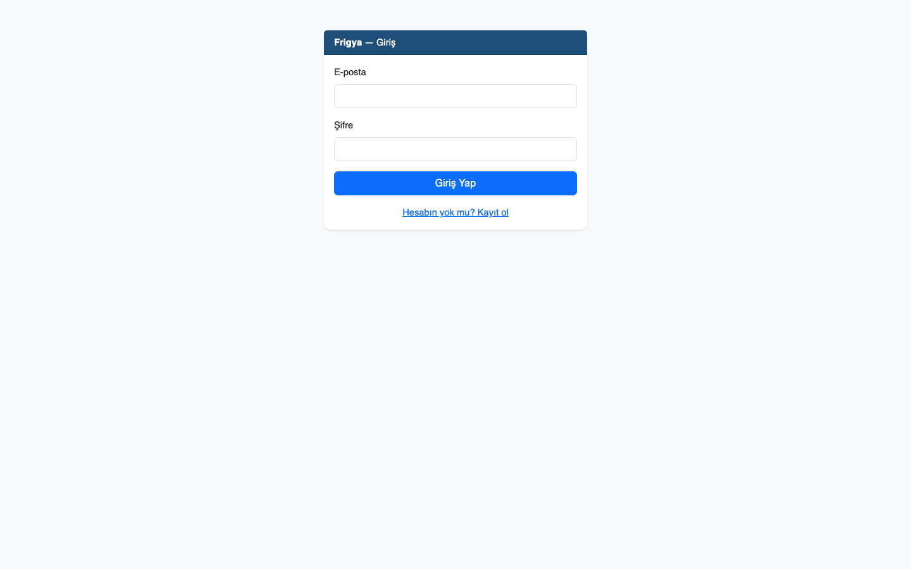
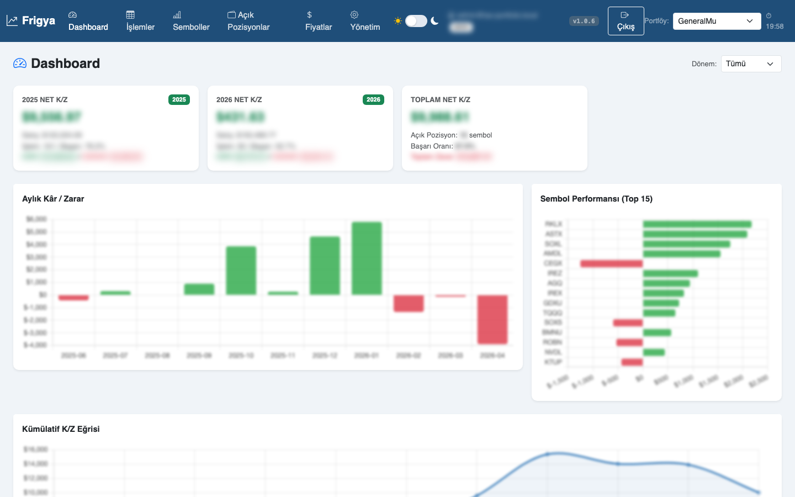
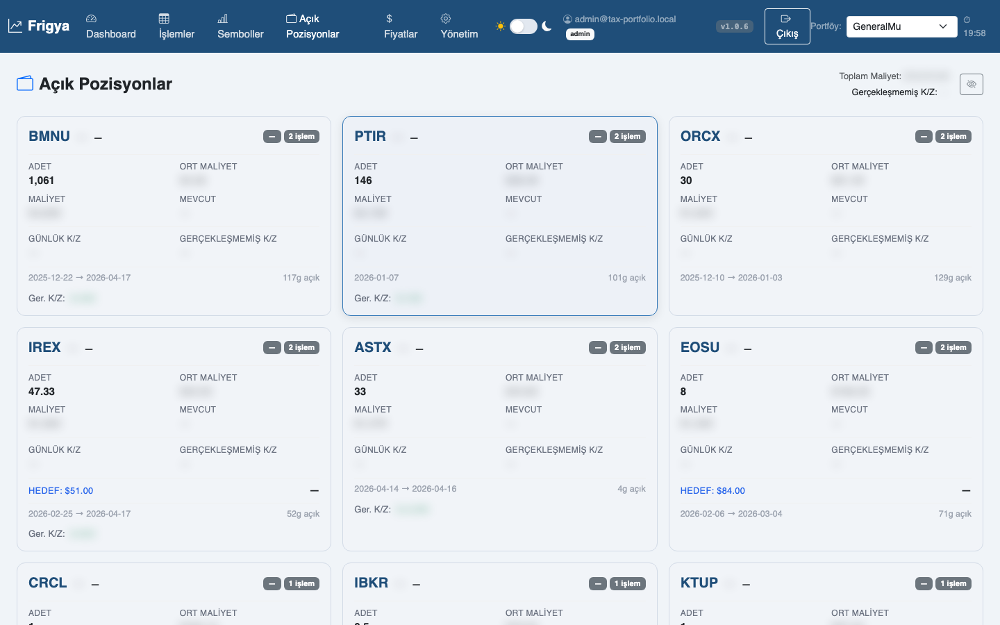
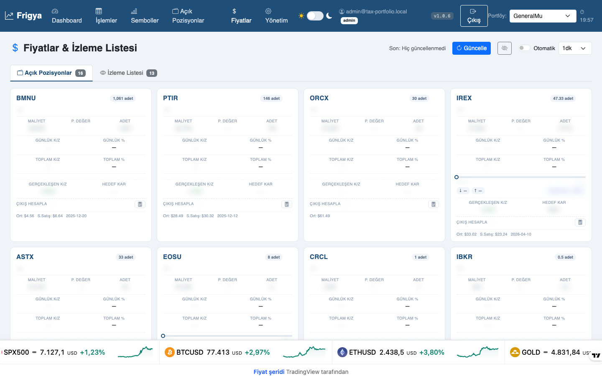
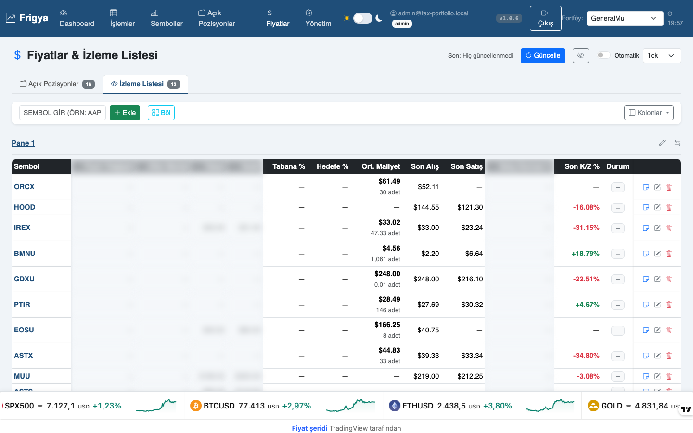
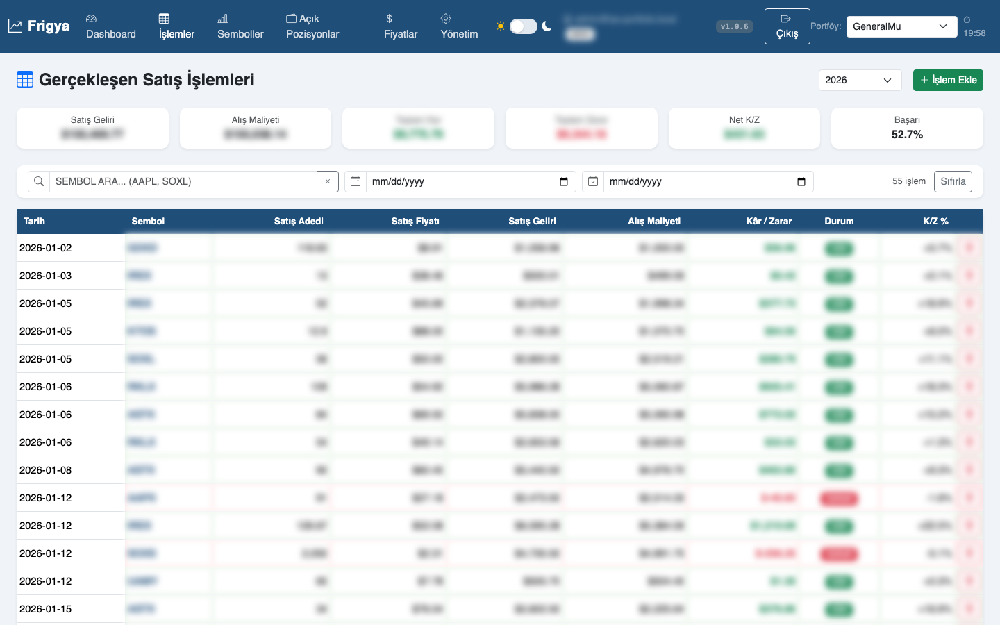
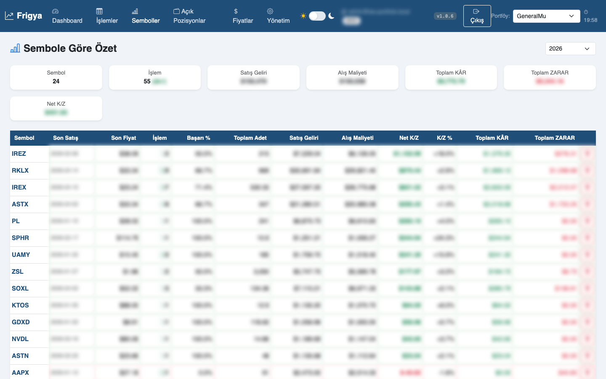
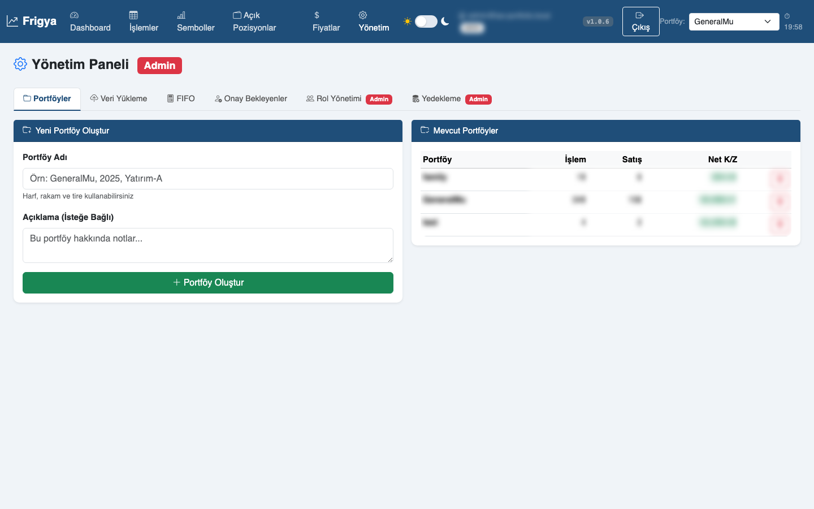

<div align="center">

# 📈 Frigya

**ABD hisse senedi portföyünüz için FIFO maliyet takibi ve Türk vergi mevzuatına uygun kâr/zarar analizi.**

FastAPI · SQLite · Jinja2 · Bootstrap 5 · TradingView

[Özellikler](#-özellikler) · [Ekran Görüntüleri](#-ekran-görüntüleri) · [Hızlı Başlangıç](#-hızlı-başlangıç) · [Mimari](#-mimari) · [Veri & Gizlilik](#-veri--gizlilik)

</div>

---

## ✨ Özellikler

- **FIFO maliyet motoru** — Türk vergi mevzuatının temel aldığı "İlk Giren İlk Çıkar" yöntemiyle her satışta gerçekleşen kâr/zararı hesaplar.
- **Çoklu kullanıcı + admin onay akışı** — Kendi kendine kayıt açık; yeni kullanıcı admin onayından geçmeden uygulamaya giremez. Google OAuth desteği.
- **Çoklu portföy** — Tek kullanıcı altında birden fazla portföy (örn. *GenelMV*, *Emeklilik*, *Yatırım-A*).
- **Açık pozisyon & lot takibi** — Her sembol için açık lotları, ortalama maliyet, anlık değer ve gerçekleşmemiş K/Z.
- **İzleme listesi** — Sembol ekleyip taban/hedef fiyat belirle, stop seviyeleri, alım-satım sonrası kâr hesapları.
- **Canlı fiyat entegrasyonu** — `yfinance` üzerinden anlık kotasyon + TradingView grafik/ticker widget'ları.
- **Veri yükleme** — Midas CSV (`emir-gecmisi-tumu-*.csv`) ve aylık PDF ekstreleri tek tıkla içe aktar.
- **Gizlilik modu** 🕶️ — Klasik aracı kurum uygulamalarındaki gibi tek tıkla tüm parasal değerleri bulanıklaştır; % değerleri görünür kalır.
- **Dark mode** · **Responsive** · **Drag-and-drop pano düzeni** · **Otomatik SQLite yedekleme**.

---

## 📸 Ekran Görüntüleri

> **Not:** Örnek görsellerde gerçek parasal değerler gizlilik modu ile bulanıklaştırılmıştır.

### Giriş & Onay Akışı
<p align="center">
  
</p>

### Dashboard
Yıllık net K/Z kartları, aylık bar grafik, sembol performansı ve kümülatif K/Z eğrisi.
<p align="center">
  
</p>

### Açık Pozisyonlar
Her sembol için açık lot kartı — adet, ort. maliyet, günlük/toplam K/Z, hedef fiyat ilerlemesi.
<p align="center">
  
</p>

### Fiyatlar · Pozisyon Kartları
Otomatik yenilenen canlı fiyatlar, hedef/taban seviyeleri, stop takibi.
<p align="center">
  
</p>

### Fiyatlar · İzleme Listesi
Çift pencere (pane), sürükle-bırak sıralama, TradingView ticker entegrasyonu.
<p align="center">
  
</p>

### İşlemler Tablosu
Gerçekleşen satışlar — sıralanabilir, filtrelenebilir, her satırda FIFO maliyet eşleşmesi.
<p align="center">
  
</p>

### Sembol Analizi
Her sembol için detaylı sayfa: işlem geçmişi, ortalama maliyet eğrisi, gerçekleşen/gerçekleşmemiş K/Z.
<p align="center">
  
</p>

### Yönetim Paneli
Tüm kullanıcılara: portföy oluştur/sil, veri yükleme, FIFO yeniden hesapla.
Yalnızca admin'e: onay bekleyenler, rol yönetimi, SQLite yedek/geri yükleme.
<p align="center">
  
</p>

---

## 🚀 Hızlı Başlangıç

### Gereksinimler
- Python 3.11+
- `pip`

### Kurulum

```bash
git clone https://github.com/Mustafaosmanoglu61/frigya.git
cd frigya
python3 -m venv .venv && source .venv/bin/activate
pip install -r requirements.txt
cp .env.example .env       # parolanı düzenle
```

### Çalıştırma

```bash
cd webapp
uvicorn main:app --reload --port 8000
```

Tarayıcıda: <http://localhost:8000> · ilk açılışta `INITIAL_ADMIN_EMAIL` / `INITIAL_ADMIN_PASSWORD` ile giriş yap.

### Ortam Değişkenleri

| Değişken | Varsayılan | Açıklama |
|---|---|---|
| `APP_ENV` | `development` | `production` seçersen `SESSION_SECRET` zorunlu ve çerezler `https-only` olur. |
| `SESSION_SECRET` | dev fallback | Prod için rastgele 32+ bayt. |
| `DB_PATH` | `webapp/tax.db` | SQLite dosya yolu. |
| `INITIAL_ADMIN_EMAIL` | `admin@example.local` | İlk kurulumda oluşturulan admin. |
| `INITIAL_ADMIN_PASSWORD` | `CHANGE_ME_BEFORE_DEPLOY` | Deploy öncesi **mutlaka** değiştir. |
| `GOOGLE_CLIENT_ID` / `GOOGLE_CLIENT_SECRET` / `GOOGLE_REDIRECT_URI` | — | Google OAuth (opsiyonel). |

---

## 🏗 Mimari

```
frigya/
├── webapp/                    # FastAPI uygulaması
│   ├── main.py                # Uygulama entry + middleware
│   ├── auth_service.py        # Oturum, PBKDF2, onay akışı
│   ├── database.py            # SQLite şema + çok-kiracılı migrasyon
│   ├── ingestion.py           # Midas CSV / PDF parser
│   ├── price_service.py       # yfinance ile canlı kotasyon
│   ├── portfolio_helper.py    # Portföy CRUD
│   ├── fifo_service.py        # FIFO motoru (recompute)
│   ├── routers/               # Sayfa ve API router'ları
│   │   ├── dashboard.py · islemler.py · semboller.py
│   │   ├── pozisyonlar.py · fiyatlar.py · sembol_detail.py
│   │   ├── auth.py            # /auth/login, /auth/register, /auth/google/*
│   │   ├── admin.py           # /yonetim/* (herkese açık + admin-only)
│   │   └── ingest_api.py      # CSV/PDF upload API
│   ├── templates/             # Jinja2 + Bootstrap 5
│   └── static/                # CSS · JS · Chart.js
├── data/                      # Örnek veri şablonları (gerçek veri gitignored)
│   ├── transactions_2025.sample.py
│   └── carry_lots_2026.sample.py
├── build_2025_usd.py          # Excel rapor üretici
├── build_4sheet.py            # Legacy (TRY bazlı)
└── CLAUDE.md                  # Detaylı proje notları
```

### Oturum & Onay Akışı

```
  Kayıt  ─►  approval_status = "pending"
               │
               ├── Admin panel   ─► approve → login açık
               │                 └─ reject   → login kapalı ("reddedildi" mesajı)
               └── Google OAuth ─► aynı onay kuyruğuna düşer
```

Son admini reject/demote etmeye karşı koruma, self-reject/self-demote engeli mevcut.

---

## 📊 Veri & Gizlilik

Projede **hiçbir kişisel finansal veri yoktur**. İşlem geçmişleri `data/` altındaki gitignore'lu dosyalarda tutulur:

| Dosya | Durum |
|---|---|
| `data/transactions_2025.py` | ❌ gitignore'lu — kendi alım-satımların |
| `data/carry_lots_2026.py`   | ❌ gitignore'lu — yıl sonu devir lotlar |
| `data/transactions_2025.sample.py` | ✅ takipte — şablon (2 örnek tuple) |
| `data/carry_lots_2026.sample.py`   | ✅ takipte — şablon |
| `*.pdf · *.xlsx · *.csv · *.db`    | ❌ gitignore'lu |

### Kendi verinle kullanmak

```bash
cp data/transactions_2025.sample.py data/transactions_2025.py
cp data/carry_lots_2026.sample.py    data/carry_lots_2026.py
# dosyaları aç ve TX / CARRY listelerini kendi verinle doldur
```

veya doğrudan uygulama içinden **Yönetim → Veri Yükleme** menüsüyle Midas CSV/PDF yükle.

---

## 🧾 FIFO Mantığı

Her sembol için ayrı lot kuyruğu tutulur. Alış → kuyruğa ekle. Satış → kuyruğun önünden tüket:

```python
if islem == "Alış":
    fifo[sembol].append([adet, fiyat, toplam])
else:  # Satış
    kalan, cost = adet, 0.0
    while kalan > 1e-7 and fifo[sembol]:
        lot_qty, lot_price, lot_cost = fifo[sembol][0]
        if lot_qty <= kalan:
            cost  += lot_cost
            kalan -= lot_qty
            fifo[sembol].pop(0)
        else:
            frac   = kalan / lot_qty
            cost  += lot_cost * frac
            fifo[sembol][0] = [lot_qty - kalan, lot_price, lot_cost * (1 - frac)]
            kalan = 0
    kar_zarar = satis_geliri - cost
```

> ÜFE endeksleme ve TRY kuru dönüşümü dahil değildir — USD bazında kâr/zarar üretir. TRY bazlı resmi beyan için ayrı bir çalışma gerekir (bkz. [CLAUDE.md](CLAUDE.md) §13).

---

## 🛠 Teknoloji

- **Backend:** FastAPI · Starlette · SQLite
- **Auth:** PBKDF2-SHA256 · Starlette sessions · Authlib (Google OIDC)
- **Frontend:** Jinja2 · Bootstrap 5 · Chart.js · TradingView widgets
- **Fiyat:** `yfinance`
- **PDF/CSV:** `pdfplumber` · `pandas`
- **Excel:** `openpyxl`

---

## 🤝 Katkı

PR ve issue'lar açık. Büyük değişiklikler için önce issue ile tartışalım.

## 📄 Lisans

MIT · © 2026
