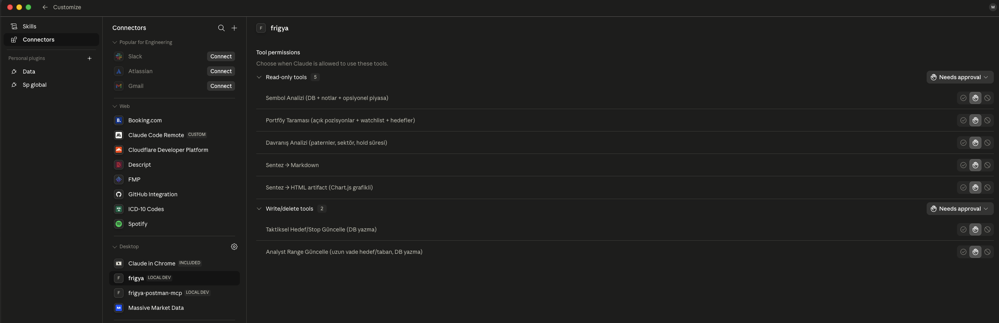

# frigya-mcp

> Portföyünü **konuşarak** analiz et: "RKLX nasıl?", "açık pozisyonlarımı tara", "stop'um
> mantıklı mı?" — Claude bu soruları frigya MCP araçlarıyla yanıtlar; servis yerelde çalışıp
> senin gerçek işlem geçmişine (`tax.db`) erişir.

## Ne işe yarar?

Frigya, US hisse alım-satımlarını Türk vergi mevzuatına göre (FIFO) takip eden bir sistem.
**frigya-mcp** bu sistemin beynini Claude'a açar: artık dashboard'da gezmek yerine doğal dille
soru sorup; pozisyon, FIFO kâr/zarar geçmişi, açık lot maliyeti, hedef/stop seviyeleri ve
davranış paternlerini tek cevapta alırsın.

### Asıl güç: kendi notlarınla birleşince

Bir fiyat grafiği herkeste var. Frigya'yı farklı kılan, üç katmanı **tek sentezde** birleştirmesi:

1. **Senin verin** — gerçek pozisyonun, FIFO maliyet bazın, bu sembolde geçmiş win rate'in, hold sürelerin
2. **Canlı piyasa** — fiyat, RSI/Stochastic/MACD, 60 günlük zirveden düşüş (Massive Market)
3. **Senin kendi notların** — `symbol_notes`'a serbest metin yazdığın tezler ("104$ ve 76$ en güçlü
   destek", "stop 33$ altı") otomatik **parse edilip seviyelere** çevrilir ve karara dahil edilir

Sonuç: "RSI 45, dipte görünüyor" diyen genel bir bot değil; **senin notundaki stop'a fiyatın ne
kadar yaklaştığını, geçmiş davranışına göre bu sembolde nasıl performans gösterdiğini ve hangi
lotun maliyet bazını bilen** kişisel bir analist. Notların ne kadar zenginse çıktı o kadar güçlü.

📄 **Örnek çıktı:** [`examples/ornek-cikti-RKLX.md`](examples/ornek-cikti-RKLX.md) — tek araç
çağrısının DB + piyasa + notları nasıl birleştirdiğini gösterir.

## Mimari ilke

```
Claude Desktop / webapp ai.py / herhangi bir chat
        │  (MCP tool çağrısı  veya  doğrudan import)
        ▼
   frigya_core paketi   ← importable çekirdek, DB sahibi, SSOT
        ▼
   ~/Tax_Portfolilo/webapp/tax.db
```

**Servis (frigya_core) DB'ye erişir, client/skill doğrudan değil.** Sandbox'taki bir agent yerel dosyaya hiç dokunmadan analiz alabilir.

`frigya_core` **importable bir Python paketi** (subprocess yok) — tek hakikat kaynağı:

| Modül | İçerik |
|---|---|
| `frigya_core/config.py` | DB yolu, kullanıcı tespiti, `open_conn()` |
| `frigya_core/db.py` | `sembol_data()`, `portfoy_data()` |
| `frigya_core/notes.py` | `parse_note()`, `parse_notes_list()` (seviye/earnings ayıklama) |
| `frigya_core/massive.py` | `normalize_teknik/haber/meta()` (Massive passthrough şekillendirici) |
| `frigya_core/davranis.py` | `davranis_data()` |
| `frigya_core/sentez.py` | `build_sentez()` — ana orkestratör |
| `frigya_core/render.py` | `render_markdown()`, `render_html()` |
| `frigya_core/yazma.py` | `hedef_guncelle()`, `analist_hedef()` (dry-run/apply) |

`server.py` bu paketi import edip 7 MCP tool'u olarak sunar. Frigya webapp `routers/ai.py` de
aynı paketi import edebilir (subprocess yerine doğrudan fonksiyon çağrısı).

## Araçlar (7)

| Tool | Tip | Ne yapar |
|---|---|---|
| `frigya_sembol_analiz` | okuma | Sembolün komple sentezi (DB + notlar + opsiyonel Massive piyasa passthrough) |
| `frigya_portfoy_tara` | okuma | Tüm açık pozisyonlar + watchlist + hedefler |
| `frigya_davranis_analiz` | okuma | Davranış paternleri (sektör, hold süresi, aylık trend) |
| `frigya_render_markdown` | okuma | Sentez JSON → kompakt markdown |
| `frigya_render_html` | okuma | Sentez JSON → HTML artifact (Chart.js grafikli) |
| `frigya_hedef_guncelle` | **yazma** | Taktiksel hedef/stop yaz (default dry-run, apply=true ile yazar) |
| `frigya_analist_hedef` | **yazma** | Uzun vade analyst range yaz (default dry-run) |

Yazma araçları **varsayılan dry-run** — `apply=true` verilmedikçe DB'ye dokunmaz.

Claude Desktop bu 7 aracı bağlı bir connector olarak görür; okuma (5) ve yazma (2)
araçları ayrı izin gruplarında, varsayılan **onay gerektirir**:



## Massive Market verisi

Server Massive API'sine doğrudan çağrı yapmaz (key gerektirmez). `frigya_sembol_analiz`
opsiyonel `market_json` passthrough alır: client önce Massive MCP'sinden veriyi çeker,
JSON olarak geçirir, server teknik + DB + notları birleştirir. Beklenen yapı:

```json
{
  "teknik": {"sma": "<raw>", "rsi": "<raw>", "macd": "<raw>", "daily": "<aggs CSV>"},
  "haber": "<news CSV>",
  "meta": {"overview": "<csv>", "related": "<csv>", "market_status": "<csv>"}
}
```

## Claude Desktop kurulumu

`~/Library/Application Support/Claude/claude_desktop_config.json` içine (zaten eklendi):

```json
{
  "mcpServers": {
    "frigya": {
      "command": "/opt/homebrew/bin/uv",
      "args": ["run", "--directory", "/Users/mustafa/Tax_Portfolilo/frigya-mcp", "python", "server.py"],
      "env": {
        "FRIGYA_SCRIPTS_DIR": "/Users/mustafa/.claude/skills/frigya-analiz/scripts",
        "DB_PATH": "/Users/mustafa/Tax_Portfolilo/webapp/tax.db"
      }
    }
  }
}
```

Ekledikten sonra **Claude Desktop'ı yeniden başlat**. Massive MCP'sini de ekli tutarsan
tam piyasa analizi için ikisini birlikte orkestre eder.

## Geliştirme / test

```bash
cd ~/Tax_Portfolilo/frigya-mcp

# Hızlı self-test (MCP client olmadan, tool'ları doğrudan dener)
uv run --python 3.12 python server.py --selftest

# Gerçek MCP stdio handshake testi
uv run --python 3.12 python _smoke.py
```

## Bağımlılıklar

- `uv` (Python sürümünü + venv'i yönetir; brew ile kuruldu)
- Python 3.12 (uv otomatik indirir)
- `mcp` SDK (pyproject.toml'da)
- Scriptler sadece stdlib kullanır (sqlite3, json, re) — ekstra bağımlılık yok

## Webapp entegrasyonu (yapıldı)

Frigya webapp `routers/frigya_ai.py` `frigya_core`'u **doğrudan import eder** (subprocess/MCP yok):

| Endpoint | Açıklama |
|---|---|
| `GET /api/ai/frigya/sembol/{symbol}?format=json\|markdown\|html&market=true` | Sembol sentezi |
| `GET /api/ai/frigya/portfoy?portfolio=` | Açık pozisyon taraması |
| `GET /api/ai/frigya/davranis?portfolio=&year=` | Davranış paternleri |

`market=true` ise `frigya_core.fetch_market` Massive REST'i **kendi key'iyle** çağırır
(`MASSIVE_API_KEY`). Key yoksa DB-only çalışır (graceful). Auth şeması `MASSIVE_AUTH_MODE`
ile ayarlanır (bearer/apikey/xapikey; bearer 401/403 olursa apikey'e otomatik düşer).

## Üç tüketici, tek çekirdek (SSOT)

```
Claude Desktop ──(MCP)──┐
Frigya webapp  ──(import)─┤──→  frigya_core  ──→  tax.db
Claude Code skill ──(MCP/script)┘
```

## Gelecek

- Webapp ai.html / sembol sayfalarına frigya analiz panelini bağla (endpoint'ler hazır)
- Massive auth şemasını canlı doğrula (key girilince `MASSIVE_AUTH_MODE` netleşir)
- Chat'e (`/api/ai/chat`) anthropic tool-use ile frigya_core'u bağla (opsiyonel, sonraki tur)
